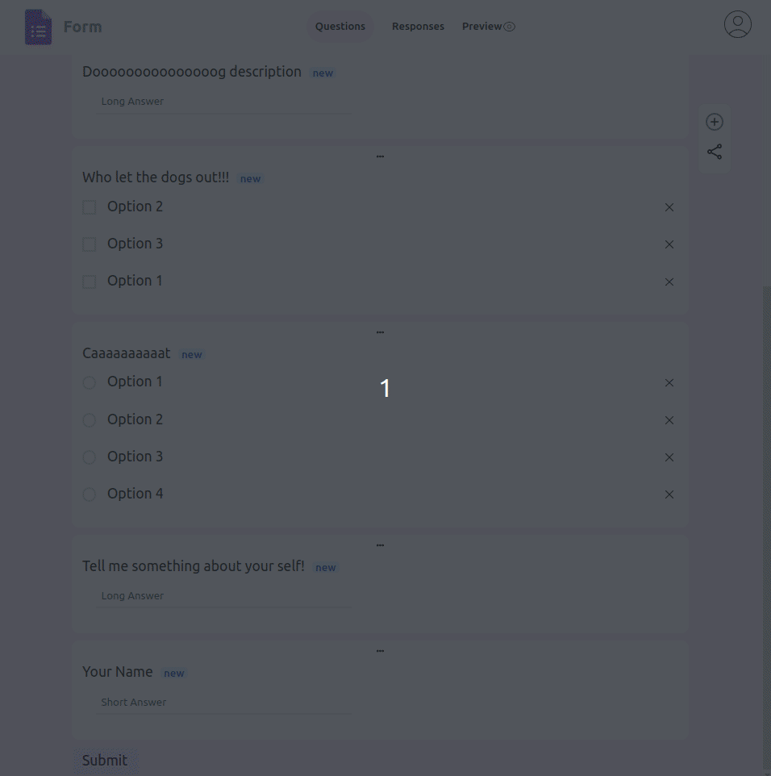

# Google Form Clone

* This is a full-stack Google Form clone using the **MERN stack**
* Implemented key features, including creating forms with different question types (short answer, multiple-choice, etc.), response summery, csv responses.
* Also Incorporated **React-Sortable-Hoc** for **drag-and-drop** functionality to sort questions and options.
Utilized Express and MongoDB on the backend for efficient data management and storage.
* Implemented secure user authentication with JSONWebToken and Bcryptjs for encrypting passwords, and provided additional authentication options with OAuth of Google and Github.

To see the backend go to https://github.com/siddhant-deshmukh/GoogleFormClone-api-docker

